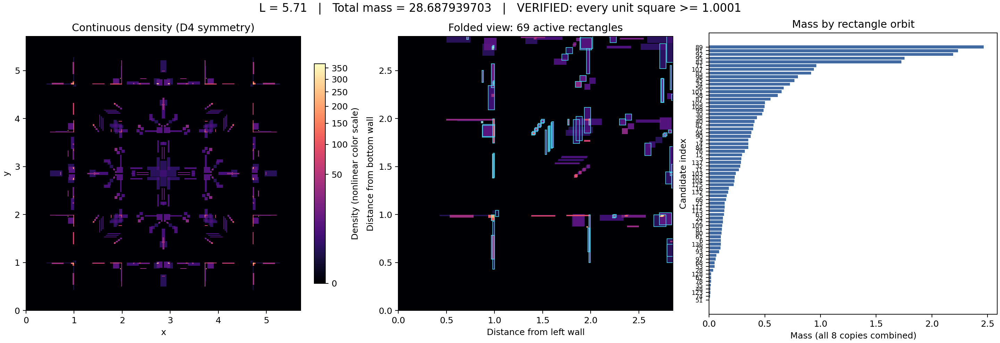

# Lower bounds for packing unit squares, from rectangle-density certificates

Let `s(n)` be the least side of a square that holds `n` unit squares with
arbitrary orientations, no two overlapping. This repository contains exact
weighted certificates proving

```
s(11) >= 381/100  = 3.81
s(26) >= 1377/250 = 5.508
s(29) >= 571/100  = 5.71
```

`n = 26` and `n = 29` improve on the point-mass certificates in
[wand125/square-packing-bounds](https://github.com/wand125/square-packing-bounds/tree/8ec3d79167ac422f21cc38d96e0dd7a8f5c22ed4),
a public repository by a different author that this work builds on
(`5.45` and `5.57` respectively). `n = 11` is not covered there.

| `n` | point-mass certificate (wand125/square-packing-bounds) | this repository | improvement |
|---|---|---|---|
| 11 | - | **3.81** | - |
| 26 | 5.45 | **5.508** | +0.058 |
| 29 | 5.57 | **5.71** | +0.14 |



The `n = 29` density (137 rectangles, 69 with positive weight after solving)
at `L = 5.71`, on a nonlinear `magma` color scale: black is zero density,
brighter/paler (through purple and red to pale yellow) is higher. See
[Verifying the certificates](#verifying-the-certificates) below for how this
is turned into a rigorous bound.

## How this differs from wand125/square-packing-bounds

wand125/square-packing-bounds's argument scatters finitely many *points*,
each with a nonnegative rational weight, and checks that every placement of
a unit square covers weight at least 1.

This repository generalizes the basis from points to axis-aligned
**rectangles**: each basis function is the uniform density over one rectangle
(area 1 after normalization), D4-symmetrized about the container's centre.
The coefficient on a rectangle is the total weight assigned to it, not a
density value. A covering linear program

```
minimize    sum(c_j)
subject to  A c >= 1 + eps        (A_ij = area of Q_i overlapped by rectangle basis j)
            c >= 0
```

is solved by row/column generation: `master.py` holds the incremental HiGHS
LP state, `pricing.py` proposes new rectangles from the LP's dual, and
`separation.py` searches for square placements the current basis fails to
cover. `engine.py` drives the cycle at fixed `L`; `advance.py` grows `L` and
repairs feasibility between steps.

This extends the same weighted-covering idea from point masses to
positive-area basis functions. Point atoms can be viewed as a limiting case
of the construction -- shrinking a positive-area uniform-density rectangle to
a point turns the density into a measure rather than the same kind of
function, so this is a limit, not literally a special case. The added
flexibility is what makes the improved bounds above possible.

## Verifying the certificates

The full mathematical argument for why `verify.cpp` is rigorous --
the density construction, the reduction from all uncountably many square
placements to a finite rational angle net, the reduction of each angle's
center-position search to a quadrant (via 90-degree rotation symmetry of
both the density and the square, not reflection -- reflection flips the
angle's sign and does not justify this), the branch-and-bound argument with
certified interval derivative bounds, and the soundness of the outward-rounded
interval arithmetic itself -- is written up in
[`docs/continuous-density-certificate.ja.md`](docs/continuous-density-certificate.ja.md)
(Japanese). Section 4 walks through `verify.cpp` line range by line range.

Each directory under `certificates/` is self-contained: the density
certificate (`certified_candidate.json`), the exact input consumed by the
verifier (`certificate_input.txt`, hex floats), the verifier itself
(`verify.cpp`), and the runner (`run_verify.py`).

```bash
cd certificates/cert_n29_L571
python3 run_verify.py --workers 4
```

This compiles `verify.cpp` (`g++ -O2 -std=c++17 -fno-fast-math -ffp-contract=off`,
outward-rounded interval arithmetic throughout -- no fast-math, no FMA
contraction) and checks, over a rational net of 201 directions, that every
placement of a unit square at that angle covers density at least `10001/10000`.
It writes `verification_summary.json` with `"status": "VERIFIED"` and the
SHA-256 of both the input and the verifier source, and prints the same
summary to stdout. `verified_angles.jsonl` has one line per direction.

Condition 5 is decided by *certified* inscribed-polygon-area lower bounds and
interval derivative bounds over each centre box, so -- unlike a floating-point
threshold check -- a `VERIFIED` result is a rigorous bound, not a numerical
approximation accepted within tolerance.

Cross-check: `src/point_export.py` converts a certified density into a
rational point cloud and validates it against wand125/square-packing-bounds's
independent point-based verifier, run unmodified from an external clone.
**This path is unlikely to succeed.** The converter
moves each grid cell's mass to the cell's center; for cells straddling a
rectangle boundary, that relocation changes the coverage right near the
boundary, and preserving the total weight does not preserve the original
density's thin margin there. In-repo testing on a comparable certificate found
`NOT VERIFIED` at both spacings tried (1/32 and 1/64). Treat this as a
diagnostic tool for inspecting a converted point cloud, not as an expected
independent confirmation. Clone
[wand125/square-packing-bounds](https://github.com/wand125/square-packing-bounds/tree/8ec3d79167ac422f21cc38d96e0dd7a8f5c22ed4)
and pass its checker explicitly (pinned to the commit this write-up refers to):

```bash
git clone https://github.com/wand125/square-packing-bounds.git /tmp/square-packing-bounds
git -C /tmp/square-packing-bounds checkout 8ec3d79167ac422f21cc38d96e0dd7a8f5c22ed4
PYTHONPATH=src python3 src/point_export.py \
  certificates/cert_n29_L571/certified_candidate.json \
  --n 29 --spacing 1/64 --out /tmp/cert_n29_points.json \
  --validator /tmp/square-packing-bounds/src/verify.py --validate
```

For a stronger independent check of the resulting point cloud, run it through
[jlevy/squares](https://github.com/jlevy/squares), which decides the covering
condition in exact integers rather than a floating-point threshold.
wand125/square-packing-bounds' `src/check_with_sqpack.py` adapts the point-cert
JSON to the input jlevy/squares expects:

```bash
git clone https://github.com/jlevy/squares.git /tmp/squares
cp /tmp/square-packing-bounds/src/check_with_sqpack.py /tmp/cert_n29_points.json /tmp/squares/
cd /tmp/squares && python3 check_with_sqpack.py cert_n29_points.json
```

## Finding new certificates

Requires Python 3.10+, NumPy, SciPy, Numba, `highspy`. See `requirements.txt`.

```bash
pip install -r requirements.txt
PYTHONPATH=src python3 src/engine.py --out /tmp/my_run --cycles 2 --b-rounds 3
```

`engine.py` runs the b/c cycle at fixed `L` (reweight the current rectangles,
then propose and add new ones from the dual); `advance.py` grows `L` from a
certified incumbent. Both checkpoint their own state so a run can resume; see
each script's `--help` for the full set of options (backend, pricing/
separation sample sizes, long-axis splitting, global-check + certify in one
pass).

Tests (require the same dependencies, plus Shapely for the independent
geometry cross-check):

```bash
PYTHONPATH=src python3 -m unittest discover -s tests -v
```

## Layout

```
certificates/      the three certificates, each self-contained and independently verifiable
src/                search engine (LP row/column generation) and the interval-arithmetic verifier
src/examples/       a small starting basis and pose set used as engine.py's defaults
tests/              unit tests for the geometry, LP incremental-update, and search logic
docs/               continuous-density-certificate.ja.md: full rigor proof for the verifier
```

## Attribution

This repository generalizes the point-mass weighted unavoidable-set argument in
[wand125/square-packing-bounds](https://github.com/wand125/square-packing-bounds/tree/8ec3d79167ac422f21cc38d96e0dd7a8f5c22ed4)
-- same method, same `B(1+D)<1` angle net on 201 directions, same D4
symmetrization -- from point atoms to a rectangle-density basis, and replaces
its floating-point Condition 5 threshold check with the outward-rounded
interval-arithmetic verifier here. See that repository's own README for the
full account, including its attribution of the underlying method to
Walter Stromquist (unavoidable point sets with unit weights), Hiroshi
Nagamochi (hand-tuned weighted score systems), Sam Burns and Gustavo
Massaccesi (the fractional weights and the exact rational direction net with
the `B(1+D)<1` shrink that this repository's own angle net also uses), and to
[jlevy/squares](https://github.com/jlevy/squares) (row generation via a
separation oracle, dual-priced column generation, and branch-and-bound as a
second Condition 5 decider). No code from wand125/square-packing-bounds is
vendored in this repository; the cross-check above clones it as an external
dependency.

## Status

Computer-assisted certificates, checked by a from-scratch interval-arithmetic
verifier. They have not been peer reviewed.

Parts of this work were produced with AI assistance under human direction.

## License

MIT. See `LICENSE`.
